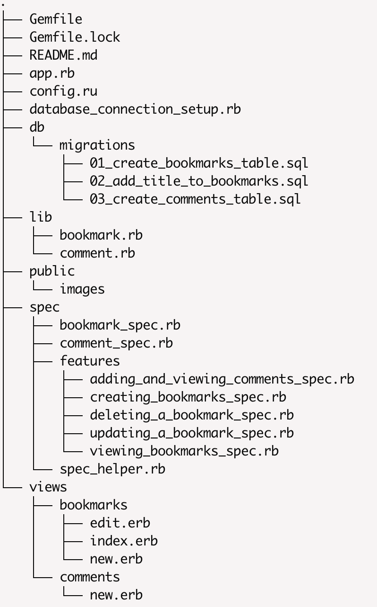

# Bookmark Manager
The aim of this project is to build a bookmark manager. A bookmark manager is a website to maintain a collection of bookmarks (URLs). You can use it to save a webpage you found useful. You can add tags to the webpages you saved to find them later. You can browse bookmarks other users have added. You can comment on the bookmarks.

User Stories 

As a user
So that I can see the webistes that I use
I'd like that I could see a list of bookmarks

As a user
So I can store a new bookmark 
I want to add a bookmark to Bookmark Manager

## Domain model

## How to use

### How to set up the project 

Clone this repository and then run `bundle`

## To run the Bookmark Manager app:

`rackup`

To view bookmarks, navigate to `localhost:9292/bookmarks`

## To run tests:

`rspec`

### To run linting:

`rubocop`

## To set up the database:

Connect to `psql`
Create the database using the `psql` command `CREATE DATABASE bookmark_manager`;
Connect to the database using the `pqsl` command `\c bookmark_manager`;
Run the queries in the `db/migrations` folder in the given order.
